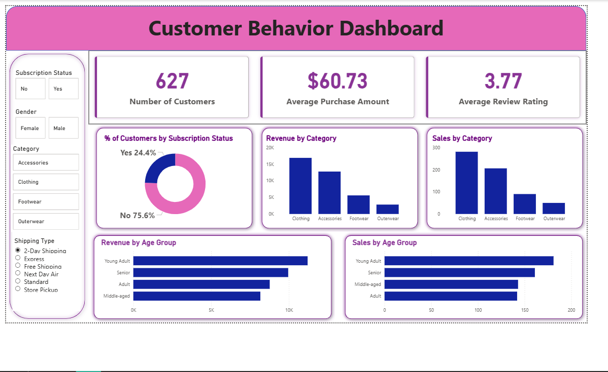

# 👨🏻‍💻 Customer Shopping Behavior Analysis (End-to-End Data Analytics Project)

## 🚀 Project Summary

Analyzed 3,900+ customer transactions to uncover revenue drivers, customer segments, and purchasing behavior using Python, SQL, and Power BI.  
This project simulates a real-world retail analytics scenario, delivering actionable insights to improve customer engagement and business performance.

---

## 📊 Dashboard Preview



---

## 📌 Business Problem

A retail company wants to better understand customer shopping behavior across demographics, product categories, and purchasing patterns.

**Objective:**  
Leverage customer data to identify trends, improve engagement, and optimize marketing and product strategies.

---

## 🎯 Project Objectives

- Analyze customer purchase behavior across segments  
- Identify key revenue drivers and high-value customers  
- Evaluate the impact of discounts and subscriptions  
- Discover category-wise and product-level trends  
- Build an interactive dashboard for decision-making  

---

## 🔄 Project Workflow

### 🧹 Data Preparation & EDA (Python)
- Cleaned and transformed raw data using Pandas  
- Handled missing values (Review Rating imputation)  
- Created new features:
  - Age group segmentation  
  - Purchase frequency  
- Ensured data consistency  

---

### 🗄️ Data Analysis (SQL)
- Revenue analysis by gender  
- Identification of high-spending customers  
- Top products by rating  
- Discount impact analysis  
- Customer segmentation (New, Returning, Loyal)  
- Shipping type comparison  

---

### 📊 Visualization (Power BI)

The dashboard provides insights into:

- Total Customers → **627**  
- Average Purchase → **$60.73**  
- Average Rating → **3.77**  
- Revenue by category (Clothing leads)  
- Sales distribution across categories  
- Age-group-based revenue and sales trends  
- Subscription behavior insights  

---

## 📈 Key Insights

- Clothing category generates the highest revenue  
- Young adults are the most valuable customer segment  
- Majority of customers are non-subscribers (~75%)  
- Discount-driven products rely heavily on promotions (~50%)  
- Express shipping users show higher average spending  
- Loyal customers dominate the overall customer base  

---

## 💼 Business Impact

This project enables businesses to:

- Identify high-value customer segments for targeted marketing  
- Optimize discount strategies to improve profitability  
- Improve customer retention through loyalty programs  
- Make data-driven decisions using interactive dashboards  

---

## 💡 Business Recommendations

- Introduce loyalty programs for repeat customers  
- Improve subscription benefits to increase adoption  
- Optimize discount strategies for profit balance  
- Focus marketing on high-revenue categories  
- Target young adult segment for campaigns  

---

## 🛠️ Tech Stack

- **Python** → Pandas, NumPy  
- **SQL** → PostgreSQL / MySQL  
- **Power BI** → Dashboard & Visualization  

---

## ⚙️ How to Run This Project

1. Clone the repository:
```bash
git clone https://github.com/ritikrjk/customer-shopping-behavior-analysis.git
cd customer-shopping-behavior-analysis
```

2. Install dependencies:
```bash
pip install -r requirements.txt
```

3. Run Jupyter Notebook:
```bash
jupyter notebook
```

4. Load data into SQL:
- Create a database  
- Execute Python script to insert data  

5. Run SQL queries:
- Open `/sql/queries.sql`  
- Execute queries  

6. Open Power BI Dashboard:
- Open `/dashboard/dashboard.pbix`  

---

## 📁 Project Structure

```
customer-shopping-behavior-analysis/
│
├── data/
├── notebooks/
├── sql/
├── dashboard/
├── screenshots/
│   └── dashboard.png
├── README.md
└── requirements.txt
```

---

## 🚀 Why This Project Matters

- Demonstrates end-to-end analytics workflow  
- Solves a real-world business problem  
- Combines Python, SQL, and BI tools  
- Shows ability to generate business insights  

---

## 🔮 Future Improvements

- Build a machine learning model to predict customer spending  
- Deploy dashboard using Streamlit for real-time interaction  
- Integrate real-time data pipeline  

---

